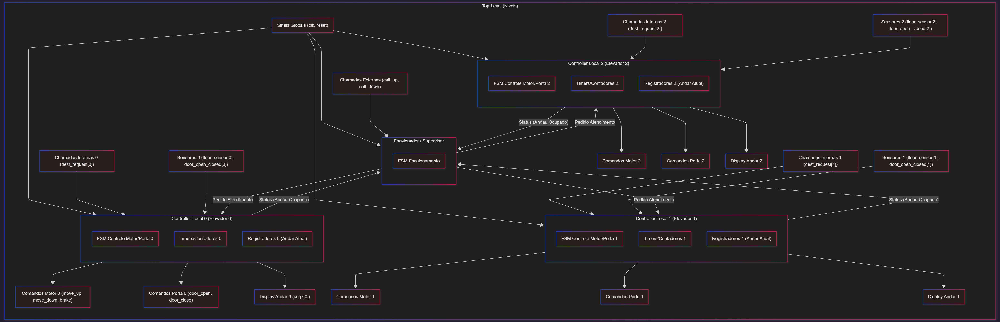

# Relatório Geral do Trabalho

## 1. Resumo e Objetivos

O objetivo deste projeto é projetar e implementar em VHDL um sistema para controlar 3 elevadores em um edifício de 32 andares (0 a 31). O sistema é dividido em dois níveis hierárquicos, conforme especificado:

1.  **Nível 1 (Controlador Local):** Um controlador individual para cada elevador, responsável por gerenciar as operações físicas como acionar o motor, controlar a abertura e fechamento das portas, e registrar o andar atual.
2.  **Nível 2 (Escalonador / Pai):** Um supervisor global que gerencia todas as chamadas externas (botões de subir/descer dos andares), decide qual dos três elevadores deve atender a cada requisição e envia os comandos para os controladores locais.

O projeto faz uso das Máquinas de Estados Finitos (FSMs) para o controle dos componentes e que vão ser validados através de simulação com testbenches em VHDL.

---

## 2. Arquitetura Geral (Diagrama de Blocos)
A arquitetura do sistema segue o modelo Controlador de dois níveis exigido. O diagrama de blocos abaixo ilustra a conexão dos módulos principais:

A arquitetura é composta por:

* **1x Módulo Escalonador (Supervisor):**
    * **Entradas:** `clk`, `rst`, todas as `Chamadas Externas (subir/descer)` e os sinais de `Status` (andar atual, direção, estado da porta) de todos os 3 elevadores.
    * **Lógica:** Implementará o algoritmo de escalonamento (descrito na Seção 4) para decidir qual elevador atenderá a chamada.
    * **Status Atual:** O arquivo `src/controllers/Escalonador.vhd` existe como um esqueleto (`entity`), e a lógica (arquitetura) está em fase de projeto.
* **3x Módulos Controladores Locais (Elevador):**
    * **Função:** O "cérebro" de cada elevador. Recebe `Chamadas Internas` e `Requisições` do Escalonador. Lê os `Sensores` e envia `Comandos` ao Motor e à Porta.
    * **Lógica Planejada:** Será implementado como uma FSM principal para gerenciar os estados: `IDLE` (Ocioso), `MOVENDO`, `ABRINDO_PORTA`, `PORTA_ABERTA` e `FECHANDO_PORTA`.
    * **Status Atual:** O arquivo `src/controllers/Elevador.vhd` existe, mas a lógica atual é só o protótipo inicial e será substituída pela FSM planejada.

* **3x Módulos de Componentes (Motor, Porta):**
    * São os "músculos" (componentes "burros") que obedecem aos comandos dos Controladores Locais.
    * O **Motor** possui sua própria FSM interna para garantir operação segura (ex: `PARADO`, `SUBINDO`, `DESCENDO`, `FREANDO`).

---

## 3. Interface de sinais usadas

A interface de sinais planejada para o módulo `top-level` (que conectará todos os blocos) é baseada nos arquivos `.vhd` existentes:

**Entradas Globais (do Testbench):**
* `clk`, `rst`: Clock global e reset.
* `chamadas_externas_subir [0..30]`: Botões de subida dos andares.
* `chamadas_externas_descer [1..31]`: Botões de descida dos andares.
* `chamadas_internas_E1, E2, E3 [0..31]`: Painéis internos de cada elevador.
* `sensor_andar_E1, E2, E3 [0..31]`: Sensores de posição (simulados).

**Saídas Globais (para Displays/Testbench):**
* `display_andar_E1, E2, E3`: Indicador de andar atual.
* `display_porta_E1, E2, E3`: Indicador de porta (aberta/fechada).
* `display_direcao_E1, E2, E3`: Indicador de movimento (subindo/descendo).

**Sinais Internos Chave (Entre Módulos):**
* `req_do_escal_E*`: Saída do Escalonador para a entrada do Controlador Local.
* `cmd_motor_E*`: Saída do Controlador Local para a entrada `comando` do Motor.
* `cmd_porta_E*`: Saída do Controlador Local para a entrada `abre` da Porta.
* `sensor_mov_E*`: Saída `em_movimento` do Motor, ligada de volta ao Controlador Local.
* `sensor_porta_E*`: Saída `porta_aberta` da Porta, ligada de volta ao Controlador Local (e ao Motor para segurança).

---

## 4. Estratégia de Escalonamento

---

## 5. Parâmetros adotados 

- **(nº de andares, tempos, etc.).**

---

## 6. Exemplos de simulação

- **Pelo menos três cenários com
capturas de forma de onda e explicação step-by-step
(ex.: chamada simultânea em andares diferentes).**

---

## 7. Problemas encontrados e decisões de projeto.
Durante o desenvolvimento, enfrentamos vários desafios de arquitetura e implementação. As decisões tomadas foram cruciais para alinhar o projeto às especificações do PDF.

* **Problema 1: Arquitetura do Escalonador (1 Botão vs. 3 Botões)**
    * **Descrição:** Houve uma confusão inicial na equipe, onde foi considerada uma arquitetura com três conjuntos de botões externos por andar (um para cada elevador).
    * **Decisão de Projeto:** Após reanálise do PDF (que exige um "Escalonador Supervisor") e do diagrama de blocos, decidimos pela arquitetura correta: **um único conjunto de botões de subir/descer por andar**. Esses botões enviam sinais exclusivamente para o Escalonador, que então gerencia os 3 elevadores.

* **Problema 2: Qualidade do Motor (Simples vs. FSM)**
    * **Descrição:** O protótipo inicial do `Motor.vhd` era uma lógica `if/elsif` simples. Isso não era robusto e não simulava a inércia (podia inverter a direção instantaneamente).
    * **Decisão de Projeto:** O `Motor.vhd` foi completamente refatorado para usar uma **Máquina de Estados Finitos (FSM)** com os estados `PARADO`, `SUBINDO`, `DESCENDO` e `FREANDO`. A adição do estado `FREANDO` (com um contador `TEMPO_FREIO`) garante uma parada segura e simula a saída `brake` exigida pelo PDF.

* **Problema 3: Arquitetura do Motor ("Burro" vs. "Inteligente")**
    * **Descrição:** Durante a refatoração do motor, foram feitas tentativas de adicionar "inteligência" a ele, como uma entrada `ocupado` para verificar se havia requisições.
    * **Decisão de Projeto:** Revertemos essas mudanças. Decidimos manter o `Motor.vhd` como um **"componente burro"** (músculo), que apenas obedece a comandos (`"00"`, `"01"`, `"10"`). A responsabilidade de saber se o sistema está "ocupado" ou não é do `Elevador.vhd` (o cérebro). Isso mantém a arquitetura de 2 níveis limpa e modular.

* **Problema 4: Erros de Compilação VHDL (Leitura de `out`)**
    * **Descrição:** Ao tentar implementar o `Elevador.vhd`, encontramos erros de compilação `cannot associate...` e `port "..." cannot be read`. Isso ocorria ao tentar conectar portas `out` (`comando_motor`) a portas `in` de componentes, ou ao ler portas `out` dentro de um processo.
    * **Decisão de Projeto:** Corrigimos isso criando **sinais internos** (ex: `comando_motor_s`, `sinal_movimento_interno`). A FSM do `Elevador` agora escreve e lê *desses* sinais internos, que por sua vez são conectados às portas dos componentes e às saídas finais da entidade.

* **Problema 5: Loop Infinito no Andar de Destino (Bug do Elevador)**
    * **Descrição:** A primeira versão da FSM do `Elevador.vhd` lia as requisições diretamente da porta de entrada. Isso causava um bug onde o elevador chegava ao destino, abria a porta, fechava, e (como a requisição de entrada ainda estava ativa) abria a porta novamente, ficando em loop.
    * **Decisão de Projeto:** Adicionamos um sinal registrador (`fila_interna_reg`) dentro do `Elevador.vhd`. O processo síncrono agora *lê* a requisição externa uma vez e a *salva* nesta fila interna. Quando o elevador atende a chamada (no estado `ABRINDO_PORTA`), ele ativamente *limpa* o bit correspondente nessa fila interna, resolvendo o loop.

---

## 8. Instruções para reproduzir simulações.